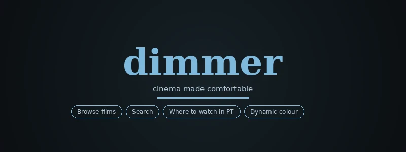
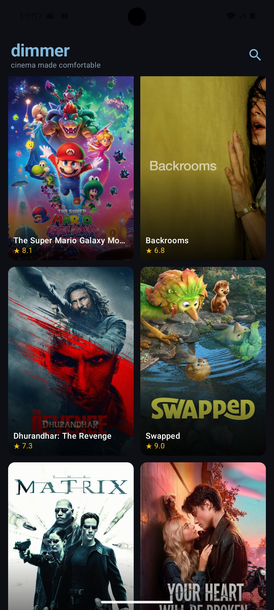
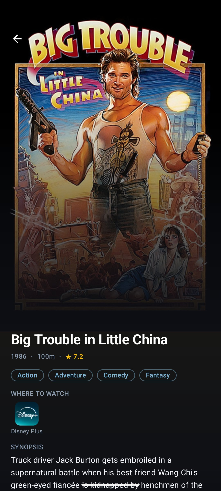
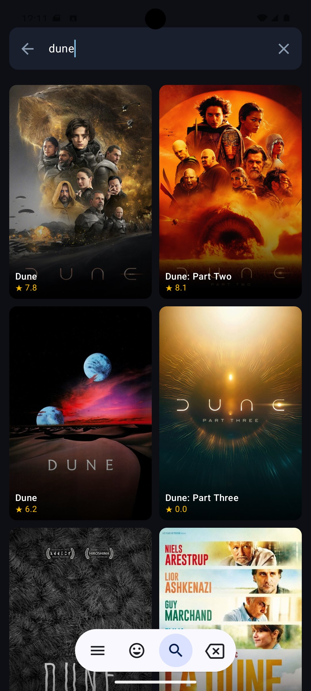

<p align="center">
  
</p>

<br>

Sometimes you just want to get home, drop your bag, fall onto the couch, and find something to watch. No endless scrolling through five different apps. No twenty minutes deciding before you give up and rewatch something you've already seen. Just a film, tonight, on whatever you already pay for.

That's what Dimmer is.

---

## What it does

Browse what's popular. Search for something specific. Tap a film and see exactly where it's streaming in Portugal right now. That's the whole thing.

🎬 &nbsp;Browse popular and trending films  
🔍 &nbsp;Search by title  
📺 &nbsp;See where to watch in Portugal (Netflix, Disney+, Prime, and more)  
🎨 &nbsp;Dynamic colour extracted from every poster  
⭐ &nbsp;Rating, runtime, genres, synopsis, and similar films

---

## Screenshots

<p float="left">
  
  
  
</p>

---

## Tech stack

| What | Why |
|---|---|
| **Kotlin** | Official Android language, concise and null-safe |
| **Jetpack Compose** | Modern declarative UI, no XML |
| **Material 3** | Dark theme, clean design system |
| **Retrofit + Moshi** | HTTP and JSON |
| **Coil** | Image loading built for Compose |
| **AndroidX Palette** | Colour extraction from poster images |
| **Compose Navigation** | Single-activity navigation |
| **TMDB API** | Film data, posters, and watch provider info |

---

## Run it locally

You'll need a free TMDB API key from [themoviedb.org](https://www.themoviedb.org/settings/api).

1. Clone the repo
   ```
   git clone https://github.com/bytiagodev/dimmer.git
   ```
2. Open in Android Studio and wait for Gradle sync
3. Add your TMDB key to `local.properties`:
   ```
   tmdb.api.key=your_key_here
   ```
4. In `RetrofitClient.kt`, make sure `API_KEY = BuildConfig.TMDB_API_KEY`
5. Run on an emulator or physical device

---

## Project structure

```
app/src/main/java/com/dimmer/app/
├── data/
│   ├── api/            Retrofit interface, API models
│   └── repository/     Repository layer
├── ui/
│   ├── home/           Home screen + ViewModel
│   ├── detail/         Detail screen + ViewModel
│   ├── search/         Search screen + ViewModel
│   ├── components/     Shared composables (FilmCard, ShimmerFilmCard)
│   └── theme/          Colors, typography, Material 3 theme
└── navigation/         NavGraph
```

---

## Acknowledgements

Film data provided by [TMDB](https://www.themoviedb.org/). This product uses the TMDB API but is not endorsed or certified by TMDB.

Typography: [Playfair Display](https://fonts.google.com/specimen/Playfair+Display) and [DM Sans](https://fonts.google.com/specimen/DM+Sans) via Google Fonts.